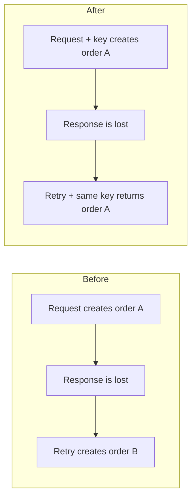

# Example: duplicate-order prevention

This is a fictional PR, not evidence about the current repository.
The behaviors and test results below illustrate the intended level of detail.
Never reuse them as claims without inspecting the actual change and results.

## Title

[orders] prevent duplicate orders on keyed retries

## Body

### Summary

A retry after a timeout can create a second order. This change returns the
original order when clients retry with the same idempotency key: an identifier
they reuse for one order request. Requests without a key are unchanged.

> **Review focus:** Keys expire after 24 hours, after which a retry can create
> another order. Is this period sufficient for supported clients' retry behavior?

### Before and after

The new path applies to the same account, an unexpired key, and matching
order details.

### Behavior

- Same key and matching order details: return the original order.
- Same key with different order details: return an error.
- Different keys or expired keys: duplicate prevention does not apply.
- Different accounts: each can use the same key independently.

Database enforcement and concurrency behavior

The server saves the key and order in the same database transaction. A uniqueness
constraint prevents two requests from claiming the same key for the same account.
The request that loses that race loads the existing order. It returns that order
if the details match, or an error if they differ.

Duplicate prevention therefore depends on the database constraint, not
coordination between server instances. Clients must preserve the key across
retries to use this protection.

### Verification

- The order API test suite passed locally.
- Tests cover repeated requests, conflicting payloads, concurrency, and account
  isolation. The concurrency test checks that simultaneous matching requests
  create one order and return it to both callers.
- No end-to-end client retry verification was performed. These tests do not
  establish whether every client preserves its key across retries.

## Why this is reviewable

The opening explains the outcome and main caveat. The diagram makes the changed
retry path visible. Behavior and verification remain easy to scan; database
mechanics are available on demand. No code access is needed to challenge the
expiration policy or the dependency on client behavior.

A smaller change could omit the diagram and collapsed section entirely.
